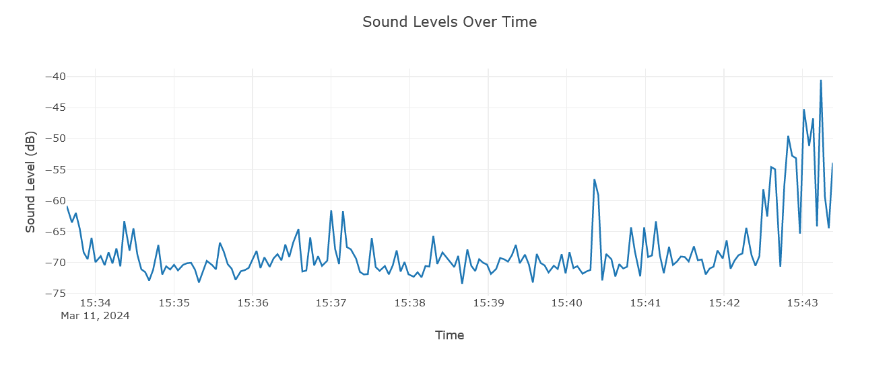
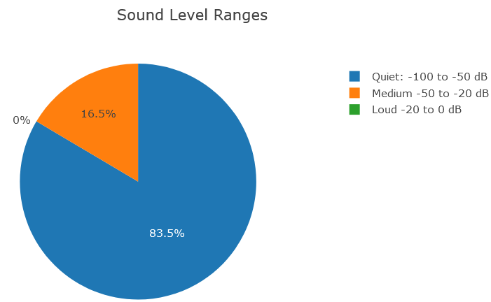

# Sound Level Monitoring

Owner: Zeul Mordasiewicz

This document serves as a guide for the Sound Level Monitoring Program. For more insights and details, refer to the conversation we had on this topic: [OpenAI Chat Transcript](https://chat.openai.com/share/82379805-20d2-4d76-8fb2-e134cedb94a9).

This is what it looks like!

Things that still need to be done:

- Take average of data points
- Only show data points since script was last run
- Use google API to save data to google sheets
